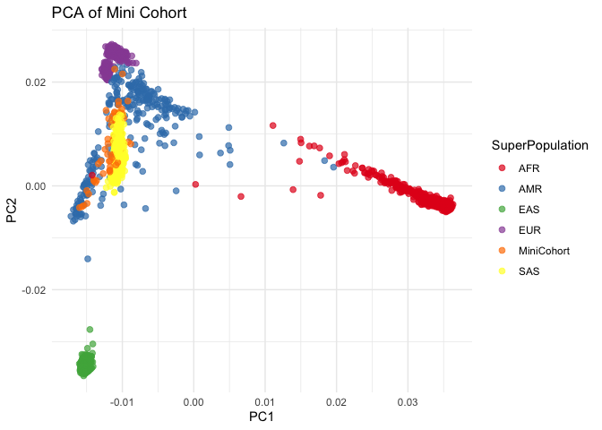
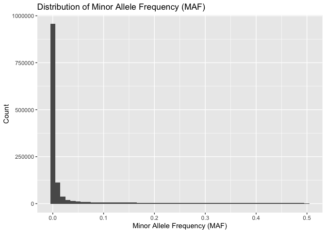
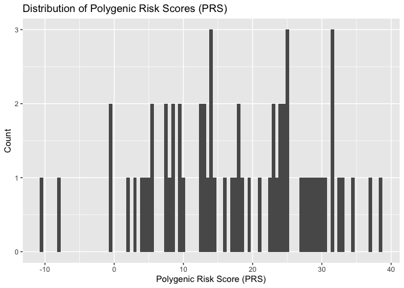

BMEG 424/525 Assignment 6
================

- [BMEG 424/525 Assignment 6: GWAS and Polygenic Risk Scores (25
  points)](#bmeg-424525-assignment-6-gwas-and-polygenic-risk-scores-25-points)
  - [Introduction:](#introduction)
    - [Goals and Objectives](#goals-and-objectives)
    - [Data](#data)
    - [Software and Tools:](#software-and-tools)
    - [Other notes:](#other-notes)
    - [Submission:](#submission)
  - [Experiment and Analysis:](#experiment-and-analysis)
    - [1. General QC of the GWAS Mini-Cohort Data (1
      pts)](#1-general-qc-of-the-gwas-mini-cohort-data-1-pts)
    - [2. Imputation of Genotypes from 1000 Genomes Data (11.5
      pts)](#2-imputation-of-genotypes-from-1000-genomes-data-115-pts)
      - [a. Linkage Disequilibrium](#a-linkage-disequilibrium)
      - [b. PCA Computation](#b-pca-computation)
      - [c. Visualization of the PCA
        results](#c-visualization-of-the-pca-results)
      - [d. Imputation](#d-imputation)
    - [3. Calculating Polygenic Scores (manual approach)
      (1.5pts)](#3-calculating-polygenic-scores-manual-approach-15pts)
    - [4. Calculating Polygenic Scores (automated approach) (2
      pts)](#4-calculating-polygenic-scores-automated-approach-2-pts)
      - [a. Setting up the pgsc_calc
        pipeline](#a-setting-up-the-pgsc_calc-pipeline)
      - [b. Running the pipeline](#b-running-the-pipeline)
  - [Discussion (9 pts)](#discussion-9-pts)

# BMEG 424/525 Assignment 6: GWAS and Polygenic Risk Scores (25 points)

## Introduction:

### Goals and Objectives

The goal of this assignment is to teach you about the basics of working
with GWAS data, including imputation of genotypes, QC, and using
polygenic scores. Polygenic scores (PRSs) can be useful for predicting
disease susceptibility. This is essential for complex diseases which are
not monogenic (i.e. caused by a single gene).

Our goal for this assignment will be to produce a PRS for a complex
trait using two different approaches; a manual approach to teach you the
basics of how PRSs are calculated from GWAS data, and a more automated
(and more accurate) approach using the `PRSc_calc` pipeline.

### Data

We will be using three different datasets during this assignment:

- Mini Cohort of samples from the 1000 Genomes Project contain in the
  `MiniCohort` folder. Each dataset is in the “bfile” format used by
  blink which is in fact three different files: `*.bed`, `*.bim`, and
  `*.fam`. The `*.bim` file contains the SNP information, the `*.fam`
  file contains the sample information, and the `*.bed` file contains
  the genotype information (NOTE: this `.bed` file is NOT the same as
  the binary file format used by the `bedtools` package). There is also
  a reference 1KGP dataset which we will use for imputation.

- A simulated dataset in the `Tapas` folder. This dataset is in the same
  format as the 1000 Genomes data.

- A pair of simulated patient data files in the `VCF` folder. These
  files are in the VCF format which you used in your very first
  assignment.

All of the data is located in `/projects/bmeg/A6`.

### Software and Tools:

We will be using a few new tools in this assignment:

1.  `plink` is a tool for working with GWAS data. It is a command line
    tool, so you will need to use it from the terminal. You can find the
    documentation for `plink`
    [here](https://www.cog-genomics.org/plink/1.9/). `plink` can be
    installed from the bioconda channel using the command
    `conda install -c bioconda plink`. You can create a new environment
    for plink, but make sure you do not try to install nextflow in the
    same environment.

2.  `nextflow` is a tool for running workflows/pipelines. It is a
    command line tool, so you will need to use it from the terminal. You
    can find the documentation for `nextflow`
    [here](https://www.nextflow.io/). NOTE: Nextflow is already
    installed on the server but **we will install it via conda, ensure
    you are using the correct version.**

### Other notes:

- As always you must cite any sources you use in your assignment (class
  slides are exempted). This includes any code you use from
  StackOverflow, ChatGPT, Github, etc. Failure to cite your sources will
  result in (at least) a zero on the assignment.

- When you begin your assignment do not copy the data from
  `/projects/bmeg/A6/` to your home directory. You can use the files in
  the projects folder without modifying them. Remember to output any
  files you create in your home directory *and not in the projects
  directory*. You should gzip files while you are working on the
  assignment and remember to delete files you no long need. If you take
  up too much space in your home directory which will cause issues as
  we’ve seen already.

- **The nextflow portion of the assignment (part 4) can take 3 hours to
  run, you should get this running ASAP.**

### Submission:

Submit your assignment as a knitted RMarkdown document. *Remember to
specify the output as github_document*. You will push your knitted
RMarkdown document to your github repository (one for each group).
Double check that all files (including figures) necessary for your
document to render properly are uploaded to your repository.

You will then submit the link, along with the names and student numbers
of all students who worked on the assignment to the assignment 3 page on
Canvas. Your assignment should be submtited, and your last commit should
be made, before 11:59pm on the day of the deadline. Late assignments
will be deducted 10% per day late. Assignments will not be accepted
after 3 days past the deadline.

## Experiment and Analysis:

### 1. General QC of the GWAS Mini-Cohort Data (1 pts)

Before we can start working on the genetic data, we need to ensure that
the quality is adequate. Thus, we are gonna check the following
measuring for our MiniCohort:

1.  **SNP call rate:** The call rate represents the percentage of
    participants with non-missing data for that SNP. Removing variants
    with a call rate lower than 95% avoids potential wrong calls to be
    included in further analysis. Therefore we would like to *remove all
    SNPs with more than 5% missingness*

2.  **Minor Allele Frequency:** The minor allele frequency (MAF) echoes
    the less common allele frequency across the population. The MAF
    estimates tend to be more accurate for higher MAFs and the
    population sample size the MAF was based on. If there are too few
    samples representing the rare-allele, is hard to distinguish between
    a true rare-allele and sequencing errors. For our data we would like
    to *remove all SNPs with a MAF lower than 1%*.

3.  **Sample call rate:** Similar to SNP call rate, it allows to filter
    out all samples exceeding 98% missing genetic variants out of all
    the calls. Four our data we would like to *remove all samples with
    more than 2% missingness*.

You can perform all of these filters using a single command calling
`plink`. Take a look at the plink documentation and add the arguments to
the command below to perform the QC.

``` bash
#?# 1. Fill in the following command and use it to perform the QC on the Mini-Cohort data. Read the instructions above carefully to get the right values for each argument. (1 pt)

plink --bfile /projects/bmeg/A6/MiniCohort/Mini_cohort --geno 0.05 --maf 0.01 --mind 0.02 --make-bed --out /home/mkhattak_bmeg25/environments/A6/Mini_cohort_QCed
```

### 2. Imputation of Genotypes from 1000 Genomes Data (11.5 pts)

As you learned in class, most GWAS studies are performed using a
case-control design. In this design, the frequency of a genetic variant
is compared between individuals with a disease and individuals without
the disease. The frequency of the variant is then compared between the
two groups to determine if the variant is associated with the disease.
This produces the GWAS summary statistics which can be used to calculate
a polygenic score.

However, in order to calculate the polygenic score, we need to have the
genotypes for all of the variants in the GWAS summary statistics. This
is where imputation comes in. Because most GWAS studies are performed
using a SNP array, we only have data for a subset of the variants in the
genome. Imputation is the process of using the data from the SNP array
to infer the genotypes for the rest of the variants in the genome using
a matched population of fully genotyped individuals.

We will use the 1000 Genomes Project reference data (located in
`/projects/bmeg/A6/1000G/`) to impute the genotypes for the Mini Cohort.
This dataset has genetic information of major continental populations:
Admixed American (AMR), European (EU), Asian (AS) and African (A).

#### a. Linkage Disequilibrium

As you learned in class, linkage disequilibrium (LD) is the non-random
association of alleles at different loci. This means that if you know
the genotype of one SNP, you can make an educated guess about the
genotype of another SNP. This is a problem for PCA because it will add
redundancy to the data which means those regions will dominate the top
PCs and obscure the true data structure. Therefore, we need to remove
SNPs in high LD before performing the PCA.

We have curated a list of high LD regions for you located in
`/projects/bmeg/A6/high_LD_regions_hg19.txt` which you can use to remove
the SNPs in high LD using `plink`. You can use the `--exclude` argument
to remove the SNPs in high LD.

We will also want to perform *dynamic* LD pruning which is available to
us through `plink`. This will remove SNPs which are in high LD with one
another *but are not in a known region of high LD*. This is important
because the high LD regions are not necessarily exhaustive of all SNPs a
patient may have. You can see how to do this in the following
[documentation](https://www.cog-genomics.org/plink/1.9/ld).

``` bash
# Using only one run of plink 1.9 (with different flags)
# Filter out the high-LD regions contained in the --high_LD_regions_hg19.txt-- file, located in /projects/bmeg/A7/
# Use the --indep-pairwise to do LD pruning with the following parameters:
## - Window size: 200, 
## - Variant Count: 100 
## - VIF (variance inflation factor): 0.2 
#?# 2. Type the command you use to create the Mini Cohort PCA-QCed bfile below (1pt)

plink --bfile /home/mkhattak_bmeg25/environments/A6/Mini_cohort_QCed --exclude /projects/bmeg/A6/high_LD_regions_hg19.txt --indep-pairwise 200 100 0.2 --make-bed --out /home/mkhattak_bmeg25/environments/A6/Mini_cohort_PCA_QCed
```

You should have a new file called `plink.prune.in` which you can use to
extract only the SNPs which passed the LD pruning. You can use the
`--extract` argument to do this.

``` bash
#?# 3. Use plink to extract the SNPs which passed the LD pruning from the QC'd minicohort file you created in Q1. (1pt)
plink --bfile /home/mkhattak_bmeg25/environments/A6/Mini_cohort_QCed --extract /home/mkhattak_bmeg25/environments/A6/Mini_cohort_PCA_QCed.prune.in --make-bed --out /home/mkhattak_bmeg25/environments/A6/Mini_cohort_LD_pruned

#?# 4. Do the same on the 1KGP_reference bfile which is located in /projects/bmeg/A7/1000G/ (1pt)
plink --bfile /projects/bmeg/A6/1000G/1kgp_reference --extract /home/mkhattak_bmeg25/environments/A6/Mini_cohort_PCA_QCed.prune.in --make-bed --out /home/mkhattak_bmeg25/environments/A6/1000G_LD_pruned
```

#### b. PCA Computation

In order to enhance imputation accuracy when dealing with ethnically
diverse cohorts is important to understand the genetic ancestries of the
cohort’s participants. Knowing the ancestral populations will ensure
that the most closely related population is used as a reference for the
imputation. For instance, one would not want to impute haplotypes of an
individual of Yoruban ancestry with a population of East Asians because
many of the haplotypes will differ between the two ancestries, leading
to imputing the wrong variants for the Yoruban person. Hence, we will
analyze the global ancestry of our cohort using Principal Component
Analysis (PCA). As you will remember from the last assignment PCA is an
unsupervised way to reduce the complexity of multidimensional data.

You can create a merged bfile (containing a .fam, .bed and .bim file)
from your Mini_Cohort (containing our GWAS data) and the 1000G_reference
(containing the reference data) using the `--bmerge` argument.

``` bash
#?# 5.  Merge your pruned bfiles of the Mini_cohort and the 1KGP created on the previous step (0.5pts)
## NOTE: Remember to create a new bfile (.fam, .bed and .bim files) that contains the merged data.
## IMPORTANT TIME CONSTRAINT: This step can take ~15 minutes, so make sure to check the server status before you run it!
plink --bfile /home/mkhattak_bmeg25/environments/A6/Mini_cohort_LD_pruned --bmerge /home/mkhattak_bmeg25/environments/A6/1000G_LD_pruned --make-bed --out /home/mkhattak_bmeg25/environments/A6/Mini_cohort_merged
```

You can now perform a PCA on the merged bfile you output in the last
step:

``` bash
#?# 6. Using plink, perform a PCA analysis in plink on the merged set (0.5pts)
plink --bfile /home/mkhattak_bmeg25/environments/A6/Mini_cohort_merged --pca --out /home/mkhattak_bmeg25/environments/A6/Mini_cohort_PCA
```

#### c. Visualization of the PCA results

You PCA computation should have output a `.eigenvec` file. Copy this
file, and the `samples_info.txt` file which is located in
`/projects/bmeg/A6/MiniCohort/` to your local machine. You can use the
`samples_info.txt` file to color the PCA plot by population.

First you will want to load your `.eigenvec` and `samples_info.txt` file
into R. You can use the `read.table` function to do this. Set the column
names for the `.eigenvec` file to change the column names to: FID, IID,
PC1, PC2, PC3, …, PC20. Set the column names to: FID, IID,
SuperPopulation, Population.

\#?# 7. Load the `.eigenvec` and `samples_info.txt` file into R and set
the column names as described above. (0.25 pts)

``` r
# Load eigenvec file (include the first column)
eigenvec <- read.table("~/Downloads/Mini_cohort_PCA.eigenvec", header = FALSE)
colnames(eigenvec) <- c("FID", "IID", paste0("PC", 1:20))

# Load samples_info file
samples_info <- read.table("~/Downloads/samples_info.txt", header = FALSE)
colnames(samples_info) <- c("IID", "SEX", "SuperPopulation", "Population")

# Preview the data
head(eigenvec)
```

    ##   FID     IID        PC1       PC2       PC3       PC4          PC5        PC6
    ## 1   0 HG00096 -0.0115610 0.0260549 0.0120821 0.0193929 -1.54440e-03 0.01339820
    ## 2   0 HG00097 -0.0115371 0.0256343 0.0102058 0.0181401 -4.17580e-03 0.01201670
    ## 3   0 HG00099 -0.0116357 0.0251335 0.0134208 0.0183402  3.45299e-04 0.01327560
    ## 4   0 HG00100 -0.0116479 0.0256273 0.0114527 0.0200354  3.84672e-03 0.00160826
    ## 5   0 HG00101 -0.0113807 0.0256749 0.0122255 0.0179854 -9.74060e-06 0.01815500
    ## 6   0 HG00102 -0.0119065 0.0258258 0.0117821 0.0192727 -2.40712e-03 0.01728430
    ##            PC7          PC8         PC9        PC10       PC11        PC12
    ## 1  0.000820520 -0.004246440  0.00571915 5.94862e-03 -0.0428676 -0.00441848
    ## 2 -0.000585331 -0.004365930  0.01026710 1.70205e-02 -0.0330301  0.00719917
    ## 3  0.002532490 -0.007694260 -0.00551570 5.05043e-03 -0.0475219 -0.00941999
    ## 4  0.002441800 -0.008537010  0.00101814 7.76628e-05 -0.0357880 -0.00194117
    ## 5  0.001327930 -0.000411318  0.00651908 1.28678e-03 -0.0389168 -0.01227880
    ## 6 -0.000170639 -0.002408660  0.00429231 4.04665e-03 -0.0418939  0.01033970
    ##         PC13         PC14        PC15        PC16      PC17         PC18
    ## 1 0.01136700  0.000916686  0.00168227  0.02483730 0.0383179 -0.000986993
    ## 2 0.01519400 -0.010650300 -0.00232844  0.01612550 0.0388369 -0.018219500
    ## 3 0.01117540 -0.016839100 -0.00340576 -0.00121601 0.0296616  0.006790080
    ## 4 0.00631717 -0.016955600  0.00720649  0.01607420 0.0484066 -0.010125100
    ## 5 0.01319040 -0.012478600  0.00995069  0.03178750 0.0323655 -0.001035270
    ## 6 0.00854187 -0.021118500  0.00835681  0.00977929 0.0458007 -0.006494370
    ##          PC19         PC20
    ## 1 -0.01601380  1.73853e-04
    ## 2 -0.00887372  1.33516e-03
    ## 3  0.00391975  6.48122e-03
    ## 4 -0.01729390 -2.22273e-04
    ## 5 -0.01534170  1.36987e-02
    ## 6 -0.01259390 -2.60539e-05

``` r
head(samples_info)
```

    ##       IID SEX SuperPopulation Population
    ## 1 HG00096   1             EUR        GBR
    ## 2 HG00097   2             EUR        GBR
    ## 3 HG00099   2             EUR        GBR
    ## 4 HG00100   2             EUR        GBR
    ## 5 HG00101   1             EUR        GBR
    ## 6 HG00102   2             EUR        GBR

\#?# 8. Merge the two dataframes using the IID column (look at the merge
function documentation by typing `?merge` in the R console). (0.25 pts)

``` r
# Merge eigenvec and samples_info on IID column
merged_data <- merge(eigenvec, samples_info, by = "IID")

# Preview the merged data
head(merged_data)
```

    ##       IID FID        PC1       PC2       PC3       PC4          PC5        PC6
    ## 1 HG00096   0 -0.0115610 0.0260549 0.0120821 0.0193929 -1.54440e-03 0.01339820
    ## 2 HG00097   0 -0.0115371 0.0256343 0.0102058 0.0181401 -4.17580e-03 0.01201670
    ## 3 HG00099   0 -0.0116357 0.0251335 0.0134208 0.0183402  3.45299e-04 0.01327560
    ## 4 HG00100   0 -0.0116479 0.0256273 0.0114527 0.0200354  3.84672e-03 0.00160826
    ## 5 HG00101   0 -0.0113807 0.0256749 0.0122255 0.0179854 -9.74060e-06 0.01815500
    ## 6 HG00102   0 -0.0119065 0.0258258 0.0117821 0.0192727 -2.40712e-03 0.01728430
    ##            PC7          PC8         PC9        PC10       PC11        PC12
    ## 1  0.000820520 -0.004246440  0.00571915 5.94862e-03 -0.0428676 -0.00441848
    ## 2 -0.000585331 -0.004365930  0.01026710 1.70205e-02 -0.0330301  0.00719917
    ## 3  0.002532490 -0.007694260 -0.00551570 5.05043e-03 -0.0475219 -0.00941999
    ## 4  0.002441800 -0.008537010  0.00101814 7.76628e-05 -0.0357880 -0.00194117
    ## 5  0.001327930 -0.000411318  0.00651908 1.28678e-03 -0.0389168 -0.01227880
    ## 6 -0.000170639 -0.002408660  0.00429231 4.04665e-03 -0.0418939  0.01033970
    ##         PC13         PC14        PC15        PC16      PC17         PC18
    ## 1 0.01136700  0.000916686  0.00168227  0.02483730 0.0383179 -0.000986993
    ## 2 0.01519400 -0.010650300 -0.00232844  0.01612550 0.0388369 -0.018219500
    ## 3 0.01117540 -0.016839100 -0.00340576 -0.00121601 0.0296616  0.006790080
    ## 4 0.00631717 -0.016955600  0.00720649  0.01607420 0.0484066 -0.010125100
    ## 5 0.01319040 -0.012478600  0.00995069  0.03178750 0.0323655 -0.001035270
    ## 6 0.00854187 -0.021118500  0.00835681  0.00977929 0.0458007 -0.006494370
    ##          PC19         PC20 SEX SuperPopulation Population
    ## 1 -0.01601380  1.73853e-04   1             EUR        GBR
    ## 2 -0.00887372  1.33516e-03   2             EUR        GBR
    ## 3  0.00391975  6.48122e-03   2             EUR        GBR
    ## 4 -0.01729390 -2.22273e-04   2             EUR        GBR
    ## 5 -0.01534170  1.36987e-02   1             EUR        GBR
    ## 6 -0.01259390 -2.60539e-05   2             EUR        GBR

\#?# 9. Using ggplot create a scatterplot, using: - x-axis: PC1 -
y-axis: PC2 - color: SuperPopulation - use the Population information to
color the samples and be able to appreciate population structure. (0.5
pts)

``` r
# include the code used to generate the plot below, when you knit your Rmd file verify that the plot is displayed
# Load ggplot2 library
library(ggplot2)

# Merge eigenvec and samples_info on IID column
merged_data <- merge(eigenvec, samples_info, by = "IID")

# Create scatterplot
ggplot(merged_data, aes(x = PC1, y = PC2, color = SuperPopulation)) +
  geom_point(size = 2, alpha = 0.7) +
  theme_minimal() +
  labs(title = "PCA of Mini Cohort",
       x = "PC1",
       y = "PC2") +
  scale_color_brewer(palette = "Set1")
```

<!-- -->

``` r
# Load the eigenvalues file
eigenvals <- scan("~/Downloads/Mini_cohort_PCA.eigenval")

# Compute the proportion of variance explained
variance_explained <- eigenvals / sum(eigenvals)

# Sum of variance captured by PC1 and PC2
top2_variance <- sum(variance_explained[1:2])

# Print result
top2_variance
```

    ## [1] 0.7816634

\#?# 10. Where do the cohort samples fall? (0.5 pts)

    In the PCA plot, the cohort samples are shown in orange (labelled as “MiniCohort”). They appear to cluster primarily with the AMR (Admixed American) and SAS (South Asian) populations. This suggests that the Mini Cohort samples have genetic similarity to individuals from the Admixed American and South Asian populations. They form a distinct but somewhat connected cluster, indicating shared ancestry or genetic mixing with these groups.

\#?# 11. Which population would you use as a reference for imputation?
Why? (1.5 pts)

    You would use the AMR (Admixed American) and SAS (South Asian) populations as references for imputation because the Mini Cohort samples cluster closely with these populations in the PCA plot. This suggests that the genetic makeup of the Mini Cohort is most similar to individuals from these groups, so using AMR and SAS as reference populations would likely result in more accurate genotype imputation due to shared haplotypes and ancestry.

#### d. Imputation

Imputation of genetic data is a very computationally intensive analysis,
that can take a long time. So we have performed it for you. Using the
chromosome 17 imputation information located in
`/projects/bmeg/A6/MiniCohort` under the
`Mini_cohort_chr17_imputation_results.info` we will calculate some
post-imputation metrics.

Load the imputation.info file into your R environment using `read.table`
and then calculate the average imputation quality for each population.

\#?# 12. What is the percentage of imputed SNPs? (1 pt)

``` r
# Load the imputation info file
imputation_info <- read.table("~/Downloads/Mini_cohort_chr17_imputation_results.info", header = TRUE)

# Calculate the percentage of imputed SNPs
total_snps <- nrow(imputation_info)
imputed_snps <- sum(imputation_info$Genotyped == "Imputed")
percentage_imputed <- (imputed_snps / total_snps) * 100

# Print the result
percentage_imputed
```

    ## [1] 99.29754

The metric of imputation quality is Rsq, this is the estimated value of
the squared correlation between imputed and true genotypes. Since true
genotypes are not available, this calculation is based on the idea that
poorly imputed genotype counts will shrink towards their expectations
based on allele frequencies observed in the population
(<https://genome.sph.umich.edu/wiki/Minimac3_Info_File#Rsq>). An Rsq \<
0.3 is often used to flag poorly imputed SNPs.

\#?# 13. What is the percentage of poorly imputed SNPs? (1 pt)

``` r
# Count the number of poorly imputed SNPs
poor_snps <- sum(imputation_info$Rsq < 0.3, na.rm = TRUE)

# Calculate the percentage of poorly imputed SNPs
percentage_poorly_imputed <- (poor_snps / total_snps) * 100

# Print result
percentage_poorly_imputed
```

    ## [1] 63.41327

\#?# 14. Visualize the distribution of the MAF in your imputed data (0.5
pts)

``` r
library(ggplot2)

# Create a histogram of the MAF distribution
ggplot(imputation_info, aes(x = MAF)) +
  geom_histogram(binwidth = 0.01) +
  labs(title = "Distribution of Minor Allele Frequency (MAF)",
       x = "Minor Allele Frequency (MAF)",
       y = "Count")
```

<!-- -->

\#?# 15. Analyze the plot above, what do you notice? Justify your
observations. (2 pts)

    The plot appears heavily skewed towards the right. That is majority of the variants lie near a MAF of 0, meaning they are quite rare in this cohort. Most lie in the 0.0 range, indicating that a large number of SNPs have very low allele frequencies. There are relatively few SNPS with higher MAFs (above 0.1), this is common to real-world data, where rare variants outnumber common variants.

### 3. Calculating Polygenic Scores (manual approach) (1.5pts)

For this section we will calculate the polygenic scores for a complex
trait; enjoyment of the Spanish snack “tapas”. A GWAS was performed and
199 SNPs were found to be significantly associated with tapas enjoyment.

The significant SNPs and their associated effect sizes (GWAS summary
statistics) are found in the `tapas` folder in the
`Tapas_enjoyability_GWAS_sumStats.txt` file.

Thanks to our imputation, we were able to impute the genotypes for the
199 significant SNPs in our Mini Cohort. The imputed genotypes are
located in the `tapas` folder in named `MiniCohort_Tapas_SNPdosages.txt`
They take the form of gene dosage (double risk alleles=2, one risk
allele=1, no risk alleles=0) for SNPs 1-199.

PRS are calculated by multiplying the effect size of each SNP by the
gene dosage (in an individual) and summing the results. Mathematically
this is represented as:

$$PRS = \sum_{i=1}^{n} \beta_{i} * G_{i}$$

Where:

- $PRS$ is the polygenic score

- $n$ is the number of SNPs

- $\beta_{i}$ is the effect size of the $i^{th}$ SNP

- $G_{i}$ is the gene dosage of the $i^{th}$ SNP

\#?# 16. Using the above information, calculate the PRS for each
individual in the Mini Cohort and plot them using a histogram (1.0 pts).

``` r
# Tip: You only need the files in the tapas directory to complete this question
## compute PRSs

# Load the GWAS summary statistics
sumstats <- read.table("~/Downloads/Tapas_enjoyability_GWAS_sumStats.txt", header = TRUE, stringsAsFactors = FALSE)

# Load the SNP dosage file
dosages <- read.table("~/Downloads/MiniCohort_Tapas_SNPdosages.txt",  header = TRUE, stringsAsFactors = FALSE)

# Extract effect sizes
effect_sizes <- sumstats$Effect_Size

# Extract SNP dosage, starting at third column
snp_dosages <- as.matrix(dosages[, 3:ncol(dosages)])

# Calculate PRS
PRS <- snp_dosages %*% effect_sizes

# Add PRS as new column to the dosages dataframe
dosages$PRS <- PRS

# Plot the distribution of PRS values
ggplot(dosages, aes(x = PRS)) +
  geom_histogram(binwidth = 0.5) +
  labs(
    title = "Distribution of Polygenic Risk Scores (PRS)",
    x = "Polygenic Risk Score (PRS)",
    y = "Count"
  )
```

<!-- -->

``` r
## plot histogram
```

\#?# 17. What do you notice about the distribution of the PRSs? (0.5 pt)

    The PRS values range broadly from -10 up to around forty, indicating substantial variability across individuals in the cohort. Rather than clustering around a single peak, the histogram shows several smaller spikes, suggesting that the distribution is somewhat irregular. This pattern likely reflects the discrete nature of genotype dosages (0, 1, or 2) multiplied by different effect sizes, resulting in multiple distinct “steps” rather than a smooth curve.

### 4. Calculating Polygenic Scores (automated approach) (2 pts)

#### a. Setting up the pgsc_calc pipeline

`pgsc_calc` is a pipeline that automates the calculation of polygenic
scores given a set of genotypes in bfile format. It uses the PGS
catalog’s GWAS summary statistics compiled over many experiments for
many traits to calculate the PRS.

The pipeline primarily uses nextflow and docker to operate. Installing
docker and nextflow on our system is not easy and so we have done it for
you. You can find a yaml file to install a conda environment with
nextflow and all its requirements already installed at
`/projects/bmeg/A6/nextflow.yaml`. You can install this environment
using the command
`conda env create <env_name> -f /projects/bmeg/A6/nextflow.yaml`. **Do
not try to install in an existing environment.**

Once you have created your environment, you can run the pipeline using
the command `nextflow run pgscatalog/pgsc_calc -profile test,conda`. The
pipeline will perform a test run using dummy data to ensure your
installation is correct.

**Important: Nextflow has to install the pipeline and all it’s (many)
dependencies the first time you run it. This can take a long time (up to
30 minutes). Running the pipeline after can take 1-2 hours.**

#### b. Running the pipeline

You will need to run the pipeline on the bfile files located in
`/projects/bmeg/A6/pgsc_calc/`. You cannot pass these directly to
`pgsc_calc` but instead must use a sample sheet which you can find in
the same directory (# Tip:
<https://pgsc-calc.readthedocs.io/en/latest/how-to/prepare.html>).

Now that we have our sample sheet set up, we need to find our other
input to pgsc_calc; the scoring files. The scoring files used by
pgsc_calc come from the Polygenic Score (PGS) catalog and contain
variant associations/effect sizes determined through GWAS. This large
public repository makes things much easier for researchers like us.

The PGS catalog groups all score files associated with a particular
trait under a specific EFO id. The EFO id we will be using today is
MONDO_0008315.

\#?# 18. What is the trait associated with the EFO id MONDO_0008315? (1
pt)

    Prostate cancer.

``` bash
#?# 19. Use nextflow to run the pgsc_calc pipeline on the bfile files located in /projects/bmeg/A6/pgsc_calc/. (1 pt) Remember to use:
# - the sample sheet mentioned in the previous paragraph
# - the EFO id mentioned in the paragraph
# - the hg19 (GRCh37) reference genome
# - the conda profile
# - a minimum overlap of 0.45
nextflow run pgscatalog/pgsc_calc -profile conda --input ~/A6_analysis/A6_pgscalc/samplesheet_bfile_p3.csv --efo_id MONDO_0008315 --target_build GRCh37 --min_overlap 0.45
nextflow run pgscatalog/pgsc_calc -profile conda --input ~/A6_analysis/A6_pgscalc/samplesheet_bfile_p6.csv --efo_id MONDO_0008315 --target_build GRCh37 --min_overlap 0.45
```

## Discussion (9 pts)

\#?# 20. What assumption of PCA is violated by the presence of SNPs in
LD with one another? (1pt)

    The assumption of independence is violated by the presence of SNPs in linkage disequilibrium (LD). PCA assumes that the input features (in this case, SNPs) are uncorrelated, but LD means that some SNPs are statistically correlated with each other, which violates this assumption.

\#?# 21. Do you think looking at the top two PCs for our Mini Cohort was
enough to determine the ancestry of the samples? Why or why not? (3 pts)

    Looking at the PCA graph, the top two PCs seem to separate different superpopulations fairly well (e.g., AFR, EAS, EUR, and SAS clusters are distinct). The Mini Cohort (in orange) is clustered between the AMR and SAS groups but shows some overlap.

    This suggests that while the top two PCs provide reasonable separation, there is some overlap, indicating that additional PCs might reveal more ancestry-related structure. While the top 2 PCs capture most of it, the output of the coverage of them of the data using the eigenval file from the server yields 78%. If it covered the missing 22%, or at least 12% more, for better measure, it would likely be more reliable. Therefore, the top two PCs give a good initial insight, but more PCs may be needed for a more precise determination of ancestry.

\#?# 22. Examine the report generated by pgsc_calc. Also look at the
aggregated_scores.txt.gz (remember to unzip the file!). Summarize the
results for both patients with regards to both conditions. (3 pts)

    Patient6 exhibits a range of polygenic scores from -1.7298 to 7.40713 across various models, with higher risk indicated in models like PGS000044 (0.705081 vs. -0.455829) and PGS000583 (-0.0051446 vs. -0.167467) compared to patient3. Patient3 shows a broader range from -2.026567 to 644.650000 (noting PGS000795 as an outlier), with higher risk in models like PGS000160 (41.8245 vs. 39.7734), PGS000714 (2.859152 vs. 1.03922), and PGS000881 (3.88414 vs. 3.8414). The genetic risk varies by PGS model. Patient3 tends to have higher scores in several overlapping models, suggesting potentially higher risk for the condition, but patient6 exceeds in others. Without a single definitive PGS model or trait confirmation, risk assessment remains model-dependent.

\#?# 23. Can you say with certainty which patient is at higher risk for
the disease analyzed in section 4, based on the PRSs? Why or why not? (1
pts)

    Due to conflicting results across PGS models, lack of model prioritization, and the inherent limitations of PRS, we cannot definitively determine which patient has a higher risk for the disease. The highest sums, for both patients, did have a passing match percent but it was still not high, or barely above 50%. On the contrary, the highest math percents had extremely low sums, indicating the limitations.

\#?# 24. If we were to repeat our PRS analysis for 4 different complex
traits, would we be able to tell which trait each patient is at higher
risk for? Why or why not? (1 pts)

    For prostate cancer and three additional complex traits, we can determine which patient has a higher genetic risk for each individual trait by comparing their PRS for that trait. However, we cannot determine which of the four traits each patient is at highest risk for overall, as PRS values are not directly comparable across different traits without additional calibration or population-based risk data.
